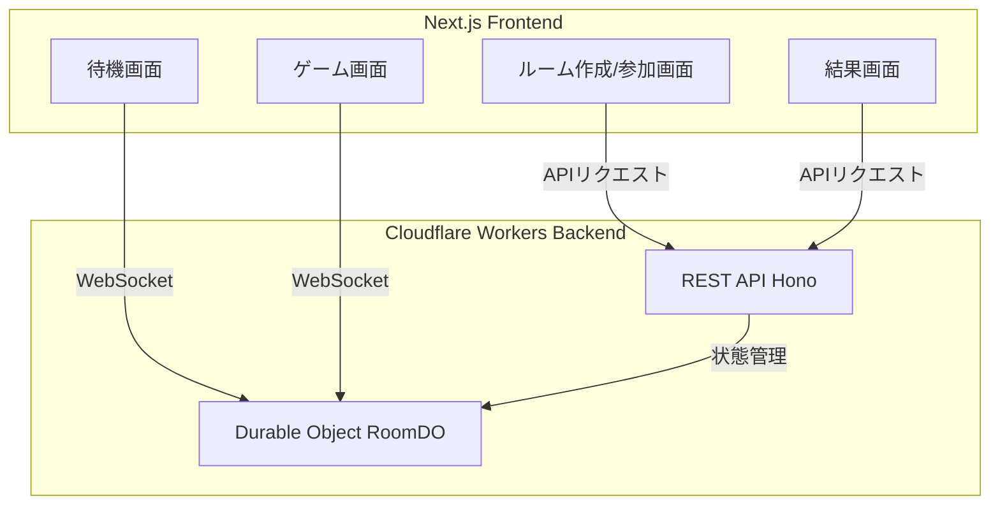
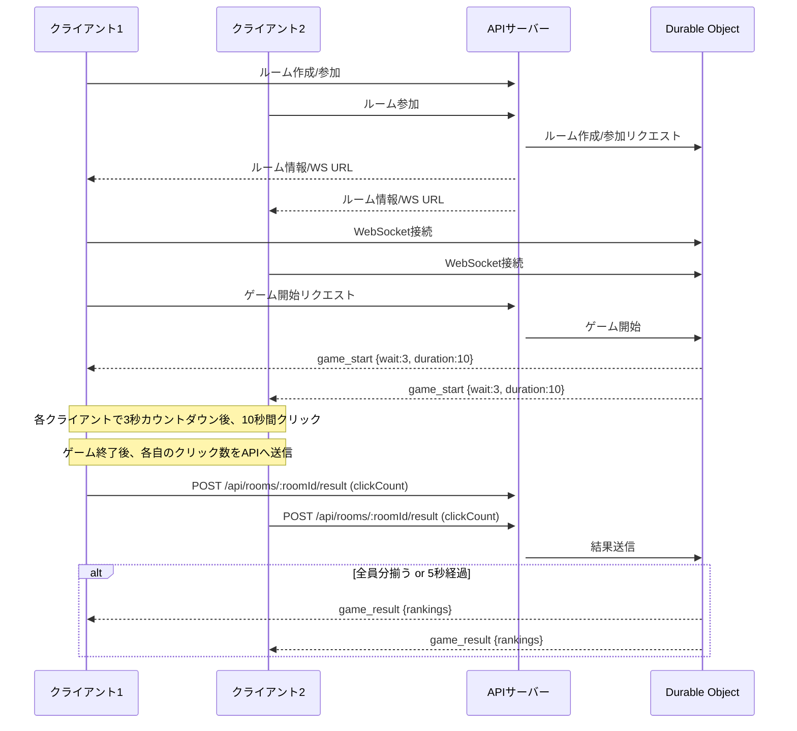

# Click Ranking Game システム仕様書

## 概要

リアルタイムでボタンのクリック数を競うWebゲーム。  
ユーザーはルームを作成・参加し、ゲーム開始後に一定時間内でクリック数を競い合い、ランキングが表示されます。  
バックエンドはCloudflare Workers + Durable Objects、フロントエンドはNext.jsで構築されています。

---

## システム全体構成・概念図



---

## 技術スタック

- **フロントエンド**: Next.js (App Router), TypeScript, React
- **バックエンド**: Hono, TypeScript, Cloudflare Workers, Cloudflare Durable Objects, Zod, Vitest
- **通信**: REST API, WebSocket
- **状態管理**: Durable Objects（ルーム・ユーザー・ゲーム進行管理）

---

## システムシーケンス図



---

## フロントエンド仕様

- **技術**: Next.js (App Router), TypeScript, React
- **主な画面・機能**
  - トップページ：ルーム作成・参加フォーム
  - ルーム作成ページ：ルーム名・最大人数・合言葉入力
  - ルーム参加ページ：ルームID・合言葉・ユーザー名入力
  - 待機画面：参加者リスト表示、ゲーム開始ボタン（作成者のみ）
  - ゲーム画面：カウントダウン後、クリック数カウント
  - 結果画面：ランキング表示
- **API通信**: REST API（ルーム作成・参加・開始・結果送信）
- **リアルタイム通信**: WebSocket（ルーム情報・ゲーム開始・結果通知）

---

## バックエンド仕様

- **技術**: Hono, TypeScript, Cloudflare Workers, Durable Objects, Zod, Vitest
- **主なAPIエンドポイント**
  - `POST /api/rooms`：ルーム作成
  - `POST /api/rooms/:roomId/join`：ルーム参加
  - `POST /api/rooms/:roomId/start`：ゲーム開始
  - `POST /api/rooms/:roomId/result`：クリック数送信
  - `GET /api/rooms/:roomId/ws`：WebSocket接続
- **Durable Object (RoomDO)**
  - ルームごとに状態を管理（参加者、ゲーム進行、クリック数集計）
  - WebSocketで参加者情報・ゲーム開始・結果を全員にブロードキャスト
- **バリデーション**: Zodによるリクエスト検証
- **テスト**: Vitestによるユニットテスト

---

## ルーム・ゲーム進行仕様

- ルーム作成時、roomIdが発行される
- 参加者はroomIdと合言葉で参加
- ルーム作成者のみ「ゲーム開始」可能
- ゲーム開始時、全員に`game_start`イベント（wait:3, duration:10）がWebSocketで通知
- 各クライアントはカウントダウン後、duration秒間クリック数をカウント
- ゲーム終了後、各自のクリック数をAPIで送信
- 全員分揃う or 5秒経過でランキングをWebSocketで全員に通知

---

## 参考：APIレスポンス例

- ルーム作成
  ```json
  {
    "success": true,
    "room": { ... },
    "user": { "id": "xxxx", ... },
    "wsUrl": "ws://localhost:8787/api/rooms/xxxx/ws?userId=xxxx"
  }
  ```
- ゲーム開始
  ```json
  { "type": "game_start", "wait": 3, "duration": 10 }
  ```
- ゲーム結果
  ```json
  {
    "type": "game_result",
    "result": {
      "rankings": [
        {"rank":1,"userId":"xxxx","userName":"A","clickCount":42},
        {"rank":2,"userId":"yyyy","userName":"B","clickCount":30}
      ]
    }
  }
  ```

---

## 注意事項

- ローカル開発（Miniflare）ではサーバー再起動で全データが消えます
- preview環境（wrangler dev --remote）は永続ストレージを保証しません
- 本番デプロイ時のみCloudflare Durable Objectsの永続化が有効です

---

この仕様書を `SYSTEM_SPEC.md` などのファイル名で保存してください。  
さらに詳細なクラス図やAPI仕様が必要な場合はご相談ください。
