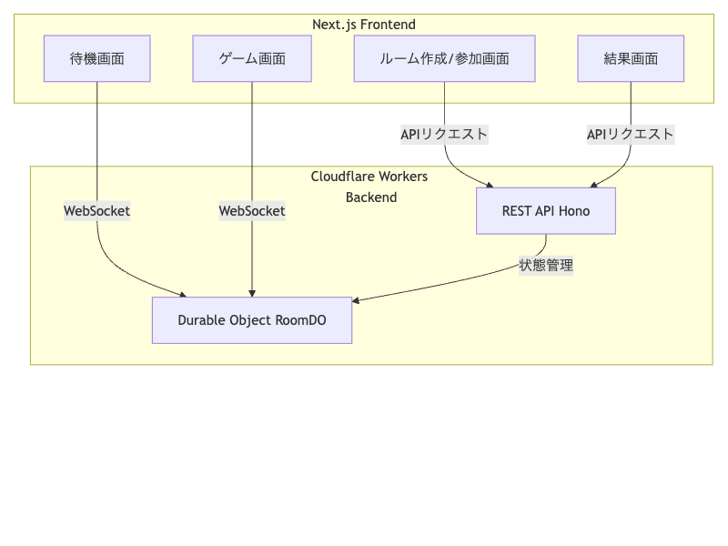
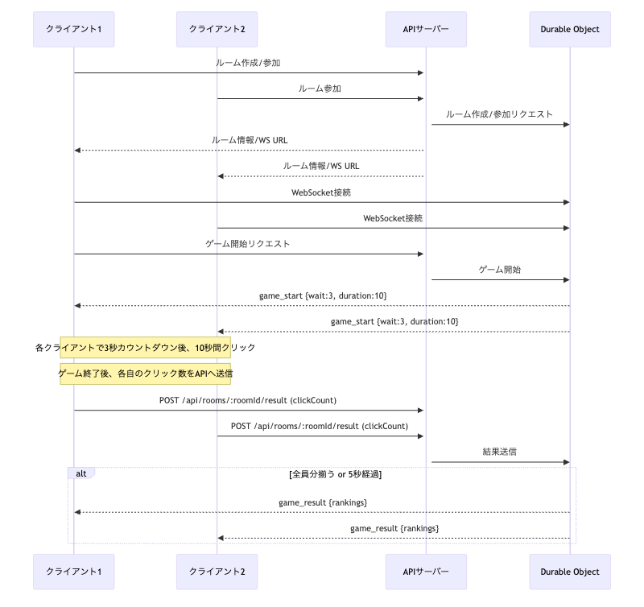

<!-- 表紙 -->
# 🎮 Click Ranking Game
### システム仕様スライド

---

## 概要

リアルタイムでボタンのクリック数を競うWebゲーム！

- ルーム作成・参加でみんなと対戦
- 一定時間内でクリック数を競い合いランキング表示
- バックエンド: Cloudflare Workers + Durable Objects
- フロントエンド: Next.js

---

## システム全体構成



- フロントエンド: ルーム作成/参加・待機・ゲーム・結果画面
- バックエンド: REST API, Durable Object, 状態管理
- WebSocket/REST APIで通信

---

## 技術スタック

- 🖥️ **フロントエンド**: Next.js (App Router), TypeScript, React
- ☁️ **バックエンド**: Hono, TypeScript, Cloudflare Workers, Durable Objects, Zod, Vitest
- 🔗 **通信**: REST API, WebSocket
- 🗃️ **状態管理**: Durable Objects

---

## システムシーケンス図

<div style="display: flex; align-items: flex-start; gap: 2em;">
  
  <ul>
    <li>ルーム作成/参加</li>
    <li>WebSocket接続</li>
    <li>ゲーム開始</li>
    <li>クリック数送信</li>
    <li>結果通知</li>
  </ul>
</div>

---

## フロントエンド仕様

- 🖥️ Next.js (App Router), TypeScript, React
- 主な画面・機能：
  - トップページ：ルーム作成・参加フォーム
  - ルーム作成ページ：ルーム名・最大人数・合言葉入力
  - ルーム参加ページ：ルームID・合言葉・ユーザー名入力
  - 待機画面：参加者リスト表示、ゲーム開始ボタン（作成者のみ）
  - ゲーム画面：カウントダウン後、クリック数カウント
  - 結果画面：ランキング表示
- API通信: REST API
- リアルタイム通信: WebSocket

---

## バックエンド仕様

- ☁️ Hono, TypeScript, Cloudflare Workers, Durable Objects, Zod, Vitest
- 主なAPIエンドポイント：
  - `POST /api/rooms`：ルーム作成
  - `POST /api/rooms/:roomId/join`：ルーム参加
  - `POST /api/rooms/:roomId/start`：ゲーム開始
  - `POST /api/rooms/:roomId/result`：クリック数送信
  - `GET /api/rooms/:roomId/ws`：WebSocket接続
- Durable Object (RoomDO)：
  - ルームごとに状態管理
  - WebSocketで全員にブロードキャスト
- バリデーション: Zod
- テスト: Vitest

---

## ルーム・ゲーム進行仕様

1. ルーム作成時、roomIdが発行
2. 参加者はroomIdと合言葉で参加
3. ルーム作成者のみ「ゲーム開始」可能
4. ゲーム開始時、全員に`game_start`イベント通知
5. 各クライアントはカウントダウン後、duration秒間クリック数をカウント
6. ゲーム終了後、各自のクリック数をAPIで送信
7. 全員分揃う or 5秒経過でランキングを通知

---

## APIレスポンス例（1/2）

- ルーム作成
```json
{
  "success": true,
  "room": { ... },
  "user": { "id": "xxxx", ... },
  "wsUrl": "ws://localhost:8787/api/rooms/xxxx/ws?userId=xxxx"
}
```
- ゲーム開始
```json
{ "type": "game_start", "wait": 3, "duration": 10 }
```

---

## APIレスポンス例（2/2）

- ゲーム結果
```json
{
  "type": "game_result",
  "result": {
    "rankings": [
      {"rank":1,"userId":"xxxx","userName":"A","clickCount":42},
      {"rank":2,"userId":"yyyy","userName":"B","clickCount":30}
    ]
  }
}
```

---

## 注意事項

- ローカル開発（Miniflare）はサーバー再起動で全データ消失
- preview環境（wrangler dev --remote）は永続ストレージ非保証
- 本番デプロイ時のみCloudflare Durable Objectsの永続化が有効

---

# ご清聴ありがとうございました！

💡 ご質問・ご相談はお気軽に！
