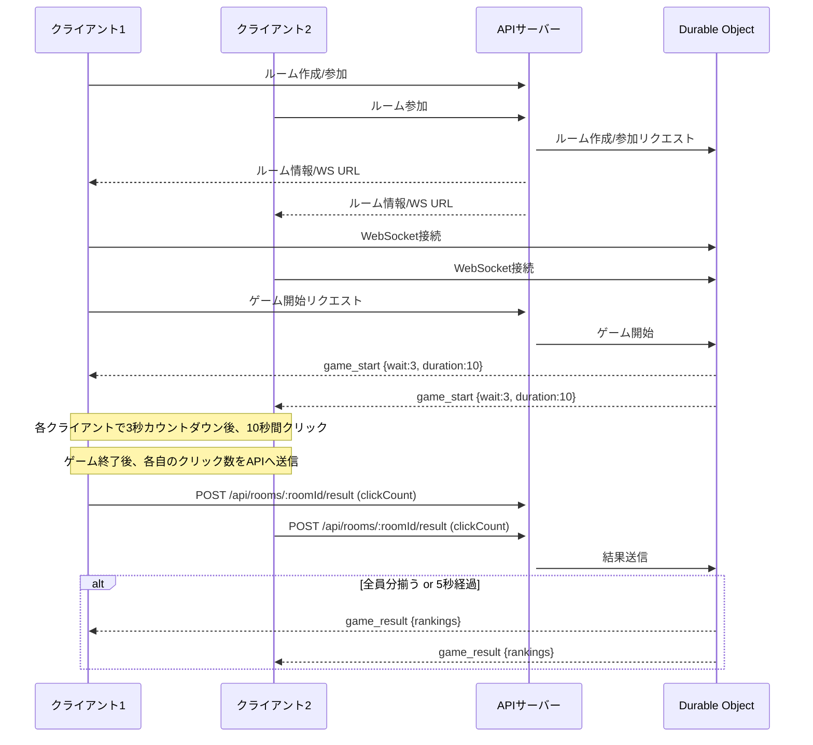

# Click Ranking Game API

リアルタイムでボタンのクリック数を競うゲームのバックエンドAPIです。Hono、TypeScript、Cloudflare Workersを使用して開発されています。

## 機能

- ルームの作成
- ルームへの参加
- ゲームの開始
- リアルタイムのクリックカウント更新
- ゲーム結果のランキング表示
- WebSocketによるリアルタイム通信

## 技術スタック

- Hono: 軽量で高速なWebフレームワーク
- TypeScript: 型安全な開発環境
- Cloudflare Workers: サーバーレス環境
- Cloudflare Durable Objects: 状態管理とWebSocket
- Zod: スキーマ検証
- Vitest: テストフレームワーク

## API エンドポイント

### ルーム関連

- `POST /api/rooms` - 新しいルームを作成
- `POST /api/rooms/:roomId/join` - ルームに参加
- `POST /api/rooms/:roomId/start` - ゲームを開始
- `DELETE /api/rooms/:roomId/users/:userId` - ルームから退出

### ゲーム関連

- `POST /api/rooms/:roomId/result` - クリックカウントを更新

### WebSocket

- `GET /api/rooms/:roomId/ws` - WebSocket接続

## 開発

```bash
# 開発サーバーを起動
pnpm dev

# テストを実行
pnpm test

# デプロイ
pnpm deploy
```

## テスト内容

`tests/` ディレクトリ内のテストケースでは、主に以下の内容を検証しています。

- ルーム作成APIの正常系・異常系（作成成功、失敗時のエラー）
- ルーム参加APIの正常系・異常系（参加成功、失敗時のエラー）
- ゲーム開始APIの正常系・異常系（開始権限、失敗時のエラー）
- クリック数送信APIの正常系・異常系（送信成功、失敗時のエラー）
- 各APIのレスポンスの型安全性
- Cloudflare Durable Objectsを利用した状態管理の動作

テストは`Vitest`で実行できます。

```bash
pnpm test
```

## デバッグ手順（最新版）

### 1. サーバー起動

```bash
pnpm dev
```

### 2. ルーム作成

```bash
curl -X POST http://localhost:8787/api/rooms \
  -H "Content-Type: application/json" \
  -d '{"name":"テストルーム","maxUsers":4,"password":"mysecret"}'
```
- レスポンス例:
```json
{
  "success": true,
  "room": { ... },
  "user": { "id": "xxxx", ... },
  "wsUrl": "ws://localhost:8787/api/rooms/xxxx/ws?userId=xxxx"
}
```

### 3. ルーム参加

```bash
curl -X POST "http://localhost:8787/api/rooms/{roomId}/join?userName=ユーザー名&password=mysecret"
```
- レスポンス例:
```json
{
  "success": true,
  "room": { ... },
  "user": { "id": "yyyy", ... },
  "wsUrl": "ws://localhost:8787/api/rooms/xxxx/ws?userId=yyyy"
}
```

### 4. WebSocketで接続

wscatなどでWebSocketに接続:
```bash
wscat -c "ws://localhost:8787/api/rooms/{roomId}/ws?userId={userId}"
```
- ゲーム開始時、以下のメッセージが届きます:
```json
{"type":"game_start","wait":3,"duration":10}
```

### 5. ゲーム開始リクエスト

ルーム作成者がゲーム開始:
```bash
curl -X POST http://localhost:8787/api/rooms/{roomId}/start \
  -H "Content-Type: application/json" \
  -d '{"userId":"xxxx"}'
```
- 全クライアントにWebSocketで `game_start` メッセージが届きます。

### 6. ゲーム終了後のクリック数送信

各クライアントはゲーム終了後にクリック数を送信:
```bash
curl -X POST http://localhost:8787/api/rooms/{roomId}/result \
  -H "Content-Type: application/json" \
  -d '{"userId":"xxxx","clickCount":42}'
```
- レスポンス例:
```json
{"success": true}
```

### 7. ランキング受信

全員分揃う or 5秒経過で、WebSocket経由で以下のメッセージが届きます:
```json
{
  "type": "game_result",
  "result": {
    "rankings": [
      {"rank":1,"userId":"xxxx","userName":"A","clickCount":42},
      {"rank":2,"userId":"yyyy","userName":"B","clickCount":30}
    ]
  }
}
```

### 8. エラー例
- 合言葉が間違っている場合、参加APIはエラーを返します。
- ゲーム未開始や終了後にクリック数を送信しようとするとエラーになります。

---

この手順でAPIの基本的な動作・認証・リアルタイム通信をデバッグできます。

以上がWebSocketを用いたリアルタイムのクリックランキングゲームのバックエンドAPIの実装です。Cloudflare Workers環境でHonoフレームワークを使用し、Durable Objectsで状態管理とWebSocket通信を実現しています。このコードは以下の設計原則に従っています：

1. **責任の分離**: コントローラー、サービス、モデル、ルーティングを明確に分離
2. **型安全性**: すべてのデータに型定義を提供
3. **エラーハンドリング**: 適切なエラー処理とレスポンス
4. **テスト可能性**: Vitestを使用したユニットテスト
5. **WebSocket通信**: リアルタイム機能の実装
6. **状態管理**: Durable Objectsを使用した永続的な状態管理

---

## 変更履歴（2024年6月）

### ゲーム進行仕様の変更
- クリック数はクライアント側でのみ管理し、ゲーム終了後にのみサーバーへ送信する方式に変更。
- ゲーム開始時、WebSocketで全クライアントに `wait`（開始までの待機秒数）と `duration`（ゲーム本体の秒数）を通知。
- クライアントは `wait` 秒カウントダウン後にゲームを開始し、`duration` 秒間だけクリックをカウント。
- ゲーム終了後、各クライアントは自身のクリック数をサーバーへ送信。
- サーバーは全員分の結果が揃うか、ゲーム終了後5秒経過で未送信ユーザーを0点扱いとしてランキングを集計し、全員にブロードキャスト。

### APIエンドポイントの変更
- クリック数送信APIを `POST /api/rooms/:roomId/result` に変更（`/click` は非推奨）。
- リクエストボディ例: `{ "userId": "...", "clickCount": 42 }`

### WebSocketメッセージ仕様
- ゲーム開始時:
  ```json
  { "type": "game_start", "wait": 3, "duration": 10 }
  ```
- ゲーム結果:
  ```json
  { "type": "game_result", "result": { "rankings": [ ... ] } }
  ```

### 注意事項
- クライアントはサーバーから受信した `wait` 秒カウントダウン後にゲームを開始してください。
- ゲーム本体の制限時間は `duration` で管理してください。
- ゲーム終了後のみクリック数を送信してください。
- 旧仕様の「クリックごとに送信」は廃止されました。

### 補足・注意事項（2025年4月20日修正）
- ルーム作成時、サーバー側で生成したroomIdがそのままDurable ObjectのIDとして使われます。
- ルーム作成APIのレスポンスで返ってきた `room.id` を、必ず参加・WebSocket・ゲーム開始・結果送信など全てのリクエストで使ってください。
- これにより、join時やWebSocket接続時に "Room not found" エラーが発生しなくなります。
- ルーム作成直後に即joinする場合、ローカル開発環境（Miniflare）ではごく稀に反映遅延が起こることがあります。その場合は1秒ほど待ってからjoinしてください。
- ルームIDのコピペミスや、古いIDの使い回しに注意してください。

## システム挙動シーケンス図


