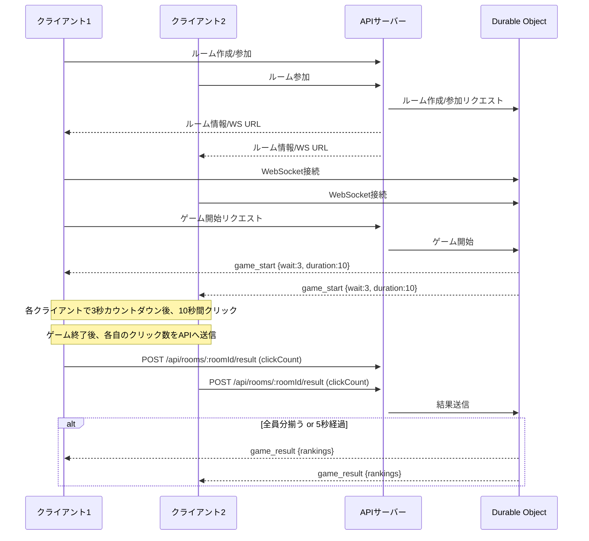

```mermaid
sequenceDiagram
  participant Client1 as クライアント1
  participant Client2 as クライアント2
  participant API as APIサーバー
  participant DO as Durable Object

  Client1->>+API: ルーム作成/参加
  Client2->>+API: ルーム参加
  API->>DO: ルーム作成/参加リクエスト
  API-->>Client1: ルーム情報/WS URL
  API-->>Client2: ルーム情報/WS URL

  Client1->>DO: WebSocket接続
  Client2->>DO: WebSocket接続

  Client1->>API: ゲーム開始リクエスト
  API->>DO: ゲーム開始
  DO-->>Client1: game_start {wait:3, duration:10}
  DO-->>Client2: game_start {wait:3, duration:10}

  Note over Client1,Client2: 各クライアントで3秒カウントダウン後、10秒間クリック

  Note over Client1,Client2: ゲーム終了後、各自のクリック数をAPIへ送信
  Client1->>API: POST /api/rooms/:roomId/result (clickCount)
  Client2->>API: POST /api/rooms/:roomId/result (clickCount)
  API->>DO: 結果送信

  alt 全員分揃う or 5秒経過
    DO-->>Client1: game_result {rankings}
    DO-->>Client2: game_result {rankings}
  end
```